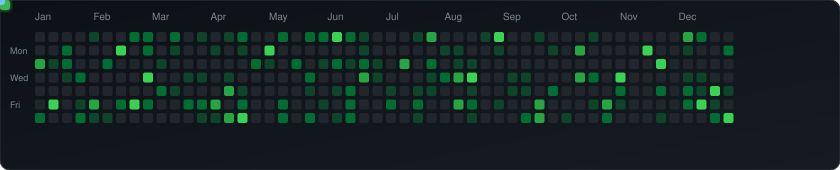

<div align="center">

<!-- Hero Banner (Dynamic Animated Wave) -->


<!-- Dynamic Animated Typing SVG -->
<a href="https://github.com/odivpds">
  
</a>

<p align="center">
  <i>"I build web applications, APIs, and digital products while continuously exploring new technologies."</i>
</p>

<!-- Quick Action Badges -->
<p align="center">
  <a href="https://odivpds.my.id">
    
  </a>
  <a href="https://github.com/odivpds">
    
  </a>
  <a href="https://linkedin.com/in/Putu%20Agus%20Prana%20Dhiva%20Satvika">
    
  </a>
  <a href="mailto:agusprana31@gmail.com">
    
  </a>
</p>

<!-- Interactive Quick Navigation Bar -->
<p align="center">
  <a href="#-about-me"></a>
  <a href="#-tech-stack-arsenal"></a>
  <a href="#-featured-projects"></a>
  <a href="#-github-metrics--activity"></a>
  <a href="#-interactive-contribution-snake"></a>
  <a href="#-connect-with-me"></a>
</p>

</div>

---

## 🧑‍💻 About Me

<details open>
<summary><b>⚡ Interactive Terminal: <code>$ odivpds --profile</code> (Click to collapse/expand)</b></summary>
<br>

```json
{
  "name": "Putu Agus Prana Dhiva Satvika",
  "alias": "odivpds",
  "role": "Full-Stack Developer & Tech Explorer",
  "location": "Indonesia 🇮🇩",
  "portfolio": "https://odivpds.my.id",
  "interests": [
    "Modern Full-Stack Architectures (Next.js, Vue, FastAPI)",
    "Clean REST & GraphQL API Design",
    "Cloud Computing & CI/CD Pipelines",
    "Cross-Platform App Development"
  ],
  "currentFocus": [
    "MoneyTree-Wevitation-Client (Frontend & Architecture)",
    "getfiles-api (Backend & File Processing)"
  ],
  "philosophy": "Build it. Break it. Learn it. Improve it."
}
```
</details>

<br>

I'm a developer who enjoys experimenting with modern technologies and turning concepts into high-impact digital products. Rather than confining myself to a single framework or language, I adopt a solution-first philosophy: **I learn and master the technology that best fits the problem.**

* 🌐 **Full-Stack Engineering:** End-to-end web apps with scalable frontends and solid backend engines.
* ⚡ **Modern JavaScript/TypeScript Ecosystem:** Deep focus on performant, type-safe development.
* 🐍 **Python & API Systems:** Microservices, automation, and data handling APIs.
* ☁️ **DevOps & Cloud:** Continuous deployment, Dockerized environments, and cloud architecture.

---

## 🛠️ Tech Stack Arsenal

<p><i>Organized into interactive expandable categories. Click any category to explore tools & proficiencies:</i></p>

<details open>
<summary><b>💻 Languages & Core Technologies</b></summary>
<br>

| Category | Technologies |
|:---|:---|
| **Core Languages** |     |
| **System & Mobile** |   |
| **Markup & Styling** |   |

</details>

<details open>
<summary><b>⚛️ Frontend & UI Frameworks</b></summary>
<br>

<p align="left">
  
  
  
  
  
  
</p>

</details>

<details open>
<summary><b>⚙️ Backend & API Frameworks</b></summary>
<br>

<p align="left">
  
  
  
  
</p>

</details>

<details>
<summary><b>🗄️ Databases, ORM & Storage</b></summary>
<br>

<p align="left">
  
  
  
  
  
</p>

</details>

<details>
<summary><b>☁️ DevOps, Cloud & Developer Tooling</b></summary>
<br>

<p align="left">
  
  
  
  
  
  
  
  
  
</p>

</details>

---

## 🌟 Featured Projects

<table>
  <tr>
    <td width="50%" valign="top">
      <h3 align="center">🌳 MoneyTree-Wevitation-Client</h3>
      <p align="center">
        
        
      </p>
      <p>A client-side application built with modern web technologies focusing on slick UI/UX, responsive layouts, and robust application architecture.</p>
      <details>
        <summary><b>🔍 Project Details & Highlights</b></summary>
        <ul>
          <li><b>Focus:</b> Frontend Performance, Clean State Management</li>
          <li><b>Ecosystem:</b> Modern JavaScript/TypeScript Stack</li>
          <li><b>Highlights:</b> Reusable design tokens, fluid animations, optimized asset delivery</li>
        </ul>
      </details>
      <br>
      <p align="center">
        <a href="https://github.com/odivpds/MoneyTree-Wevitation-Client">
          
        </a>
      </p>
    </td>
    <td width="50%" valign="top">
      <h3 align="center">📦 getfiles-api</h3>
      <p align="center">
        
        
      </p>
      <p>High-efficiency API service dedicated to robust file handling, streaming transfers, and cloud storage management.</p>
      <details>
        <summary><b>🔍 Project Details & Highlights</b></summary>
        <ul>
          <li><b>Focus:</b> Backend Performance, Security & File Integrity</li>
          <li><b>Collaboration:</b> Open to contributions, PRs, and architectural reviews</li>
          <li><b>Highlights:</b> Modular endpoint design, caching layers, scalable pipelines</li>
        </ul>
      </details>
      <br>
      <p align="center">
        <a href="https://github.com/odivpds/getfiles-api">
          
        </a>
      </p>
    </td>
  </tr>
</table>

---

## 🐍 Interactive Contribution Snake

<p align="center">
  <i>Watch the interactive cyber-snake slither across my GitHub contribution grid!</i>
</p>

<div align="center">
  <picture>
    <source media="(prefers-color-scheme: dark)" srcset="https://raw.githubusercontent.com/odivpds/odivpds/output/github-contribution-grid-snake-dark.svg">
    <source media="(prefers-color-scheme: light)" srcset="https://raw.githubusercontent.com/odivpds/odivpds/output/github-contribution-grid-snake.svg">
    
  </picture>
</div>

<p align="center">
  <sub>⚡ <i>Automatically synced and rendered every 12 hours via GitHub Actions</i></sub>
</p>

---

## 📊 GitHub Metrics & Activity

<div align="center">

<!-- GitHub Stats & Top Languages Side by Side -->
<table border="0">
  <tr>
    <td>
      <a href="https://github.com/odivpds">
        
      </a>
    </td>
    <td>
      <a href="https://github.com/odivpds">
        
      </a>
    </td>
  </tr>
</table>

<!-- Dynamic Streak Stats -->
<a href="https://github.com/odivpds">
  
</a>

<br><br>

<!-- Dynamic Random Programming Quote -->
<a href="https://quotes-github-readme.vercel.app">
  
</a>

</div>

---

## 💡 Developer Philosophy

<div align="center">

> ### *"Build it. Break it. Learn it. Improve it."*
> 
> *Technology evolves rapidly. Rather than clinging to dogmas or attempting to memorize everything, I focus on building real-world solutions, embracing experiments, and choosing the right tool for the challenge.*

</div>

---

## 🌐 Connect With Me

<div align="center">

<p>
  <a href="https://odivpds.my.id">
    
  </a>
  <a href="https://github.com/odivpds">
    
  </a>
  <a href="https://linkedin.com/in/Putu%20Agus%20Prana%20Dhiva%20Satvika">
    
  </a>
  <a href="https://instagram.com/odivpds_">
    
  </a>
  <a href="https://x.com/odivpds">
    
  </a>
  <a href="https://tiktok.com/@sirloinno7">
    
  </a>
  <a href="mailto:agusprana31@gmail.com">
    
  </a>
</p>

<br>


<br><br>

<!-- Bottom Waving Capsule Banner -->


</div>
